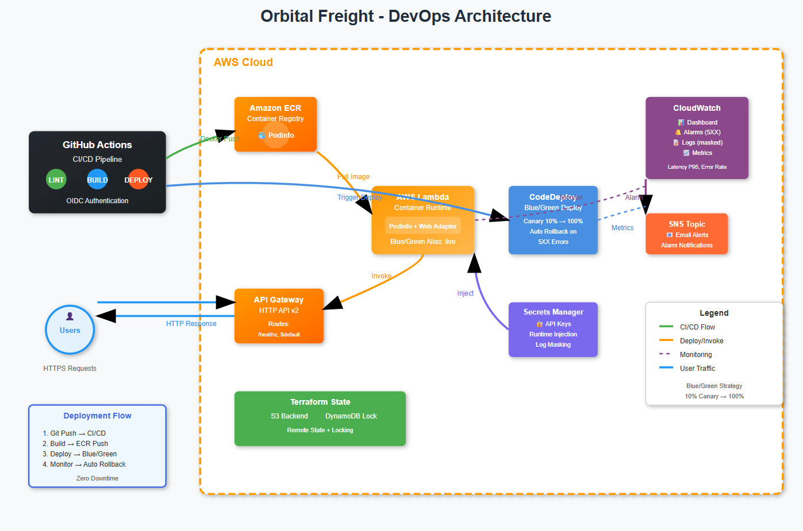

# Orbital Freight - DevOps Pipeline Completa

Una pipeline CI/CD completamente automatizzata per il deployment di **Podinfo** su AWS Lambda con strategia di deployment blue/green usando CodeDeploy.

## 🏗️ Architettura



### Componenti Principali

- **GitHub Actions** con autenticazione OIDC (senza long-lived credentials)
- **Amazon ECR** per il registry delle immagini Docker
- **AWS Lambda** con Web Adapter per eseguire Podinfo come container
- **API Gateway v2 (HTTP)** come frontend pubblico
- **CodeDeploy** per deployment blue/green con canary traffic shifting (10% → 100%)
- **CloudWatch** per monitoring, dashboard e alarms automatici
- **Secrets Manager** per gestione sicura di API keys
- **Terraform** per Infrastructure-as-Code completa

### Strategia di Deployment

Il sistema implementa una strategia **blue/green con canary deployment**:

1. **Build**: Ogni push su `main` triggera il build di una nuova immagine Docker
2. **Deploy**: CodeDeploy crea una nuova versione Lambda e shifta il 10% del traffico
3. **Monitor**: CloudWatch monitora metriche di errore per 5 minuti
4. **Promote/Rollback**: Se non ci sono errori 5xx, il traffico passa al 100%. In caso di errori, rollback automatico

## 🚀 Setup Iniziale

### Prerequisiti

- Account AWS con diritti amministrativi
- Repository GitHub
- Terraform >= 1.6.0
- AWS CLI configurato

### 1. Setup OIDC Identity Federation

Prima di tutto, configura l'identity federation GitHub → AWS:

```bash
# Clona il repository
git clone https://github.com/p-calvino/orbital-freight.git
cd orbital-freight

# Configura OIDC provider (DA LOCALE - prima volta)
cd terraform/00-identity-oidc-github
terraform init
terraform apply

# Recupera l'ARN del ruolo
terraform output role_arn
```

### 2. Configurazione GitHub Secrets

Nel tuo repository GitHub, vai su **Settings** → **Secrets and variables** → **Actions** e aggiungi:

#### Repository Secrets

- `AWS_ROLE_ARN`: ARN del ruolo dal step precedente (es. `arn:aws:iam::123456789012:role/orbital-freight-gha-oidc`)

#### Repository Variables

- `ALARM_EMAIL`: La tua email per ricevere notifiche SNS (es. `admin@example.com`)

### 3. Deploy One-Click

Una volta configurati i secrets, ogni push su `main` attiva automaticamente la pipeline completa.

Per un deploy manuale:

1. Vai su **Actions** nel repository GitHub
2. Seleziona **Demo Deploy (Optimized)**
3. Clicca **Run workflow**

## 💰 Analisi Costi

### Costi Mensili Stimati (uso leggero)

| Servizio            | Costo Mensile | Note                                  |
| ------------------- | ------------- | ------------------------------------- |
| **Lambda**          | ~$0.20        | 1M invocazioni/mese, 512MB, 200ms avg |
| **API Gateway**     | ~$3.50        | 1M richieste HTTP                     |
| **ECR**             | $0.00         | 500MB gratuiti per 12 mesi            |
| **CloudWatch**      | $0.00         | 3 dashboard + 10 alarms gratuiti      |
| **CodeDeploy**      | $0.00         | Gratuito per Lambda/EC2               |
| **Secrets Manager** | $0.40         | 1 secret, primi 30 giorni gratuiti    |
| **S3 + DynamoDB**   | ~$0.05        | Terraform state                       |
| **SNS**             | ~$0.01        | Email notifications                   |

**Totale stimato: ~$4.16/mese** (dopo i primi 12 mesi)

### Costi di Bootstrap

**Una tantum**: ~$0.00 (tutto nel free tier AWS)

## 🔧 Trade-offs e Scelte Architetturali

### ✅ Perché Lambda (Option A) vs EC2 (Option B)

**Lambda è stata scelta per:**

- **Costo**: Pay-per-execution vs always-on EC2
- **Scalabilità**: Auto-scaling nativo senza configurazione
- **Manutenzione**: Zero server management
- **Cold start**: Mitigato con provisioned concurrency se necessario
- **Blue/Green**: CodeDeploy per Lambda è più semplice che gestire ALB target groups

**Contro:**:

- Cold start latency (~200ms)
- Timeout limite 15 minuti
- Dimensioni package limitate

### 🔒 Sicurezza

- **OIDC Federation**: No long-lived AWS keys in GitHub
- **Least Privilege IAM**: Policies granulari per ogni componente
- **Secrets Management**: API keys mai hardcoded, inject a runtime
- **Log Masking**: CloudWatch Data Protection nasconde automaticamente i secrets nei log
- **Container Scanning**: ECR scan automatico delle vulnerabilità

### 📊 Monitoring Strategy

- **Golden Signals**: Latency, Traffic, Errors, Saturation
- **Proactive Alerts**: 5xx errors → automatic rollback
- **Dashboard**: Real-time visibility su request count, latency p95, error rates
- **Log Centralization**: CloudWatch Logs con retention policy

## 🧪 Testing & Validation

### Health Check Automatico

Il workflow include un health check avanzato con exponential backoff:

```bash
# Controlla l'endpoint /healthz ogni deploy
curl -f https://your-api-gateway-url/healthz
```

### Blue/Green Observation

Monitora i deployment in tempo reale:

1. **CloudWatch Dashboard**: Visualizza traffico durante il canary
2. **CodeDeploy Console**: Status real-time del deployment
3. **Lambda Console**: Versioni e alias traffic splitting
4. **CloudWatch Alarms**: Triggering automatico del rollback

## 🔄 Workflow CI/CD Avanzato

### Pipeline Stages

```mermaid

    A [Push to main] --> B[Infrastructure Bootstrap]
    A --> C[Go Lint & Test]
    B --> D[Build & Push Docker]
    D --> E[Deploy Application]
    E --> F[Configure & Health Check]

```

### Ottimizzazioni

- **Cache Intelligente**: Docker layers e Terraform providers
- **Parallel Jobs**: Build e test in parallelo quando possibile
- **Skip Logic**: Salta rebuild se l'immagine esiste già
- **Retry Mechanism**: Re-run automatico dei job falliti

### Manual Controls

Il workflow supporta controlli manuali:

- `force_rebuild`: Ignora cache e rebuilda tutto
- `skip_health_check`: Salta validazione finale

## 🛠️ Operazioni Common

### Deploy di Emergency

Se serve un deploy rapido saltando i controlli:

```bash
# Via GitHub UI
Actions → Demo Deploy → Run workflow
☑️ Skip health check
```

### Rollback Manuale

```bash
# Via AWS CLI (se il rollback automatico fallisce)
aws deploy stop-deployment --deployment-id <deployment-id> --auto-rollback-enabled
```

### Debug Pipeline

1. **Job Failed**: Usa "Re-run failed jobs" in GitHub Actions
2. **Health Check Failed**: Controlla CloudWatch Logs della Lambda
3. **CodeDeploy Issues**: AWS Console → CodeDeploy → Applications

## 🧹 Cleanup

### Rimozione Completa (è necessario puntare i backend sullo state presente su S3)

```bash
# 1. Distruggi environment
cd terraform/20-envs/dev
terraform destroy

# 2. Distruggi bootstrap (ATTENZIONE: rimuove ECR images)
cd ../../10-bootstrap-ci-iam
terraform destroy

# 3. Distruggi OIDC (opzionale, può essere riutilizzato)
cd ../../00-identity-oidc-github
terraform destroy
```

**⚠️ Warning**: Questo rimuove TUTTE le risorse e le immagini Docker. Il processo è irreversibile.

### Cleanup Automatico

- **ECR Lifecycle**: Mantiene solo le ultime 15 immagini
- **CloudWatch Logs**: Retention automatica 14 giorni
- **Lambda Versions**: Gestite da CodeDeploy

## 📝 Note sull'uso di LLM

Come suggerito nelle istruzioni, questo progetto è stato sviluppato con l'assistenza di LLM per:

- Generazione boilerplate Terraform
- Debugging di configurazioni complesse
- Ottimizzazione della pipeline CI/CD
- Best practices di sicurezza AWS

Tutti i suggerimenti sono stati verificati e testati manualmente prima dell'implementazione.

---
